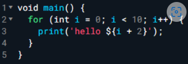
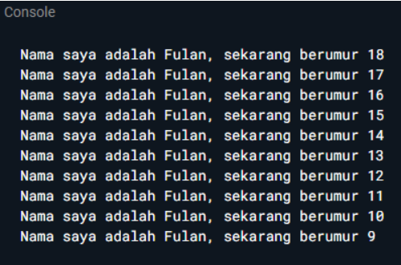
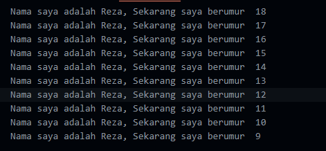

<h1 align="center">

LAPORAN PRAKTIKUM

Pemprograman Mobile


<h2 align="center">

RIZQI REZA DANUARTA

2241720057

TI-3C

## Tugas Praktikum

### Soal 1

Modifikasilah kode pada baris 3 di VS Code atau Editor Code favorit Anda berikut ini agar mendapatkan keluaran (output) sesuai yang diminta!



output yang diminta:



Jawaban :

```dart
void main() {
  for (int i = 18; i >= 9; i--) {
    print('Nama saya adalah Reza, Sekarang saya berumur  $i');
  }
}
```

jadi saya modifikasi menggunakan nama saya sendiri dan didalam perulangannya juga modifikasi seperti kode program diatas berikut adalah hasil ouputnya


### Soal 2

Mengapa sangat penting untuk memahami bahasa pemrograman Dart sebelum kita menggunakan framework Flutter ? Jelaskan!

jawaban : Memahami Dart sangat penting sebelum menggunakan Flutter karena Flutter dibangun sepenuhnya dengan Dart. Penguasaan dasar-dasar Dart memungkinkan kamu menulis kode lebih efisien dan memanfaatkan fitur Flutter secara optimal, sehingga memudahkan pengembangan aplikasi.

### Soal 3

Rangkumlah materi dari codelab ini menjadi poin-poin penting yang dapat Anda gunakan untuk membantu proses pengembangan aplikasi mobile menggunakan framework Flutter.

jawaban :

Getting Started with Dart:

- Productive Tooling: Dart memiliki alat analisis kode, plugin IDE, dan ekosistem paket yang besar.
- Garbage Collection: Mengelola memori dengan menghapus objek yang tidak digunakan.
- Type Annotations (Opsional): Menyediakan keamanan dan konsistensi data.
- Statically Typed: Dart aman dengan type-safe dan type inference.
- Portability: Dart dapat dikompilasi ke JavaScript, ARM, dan x86.
  Dart Syntax:

Awalnya untuk web, sekarang fokus pada pengembangan mobile dengan Flutter.
Bertujuan menggantikan JavaScript dengan performa tinggi dan alat modern.
Dirancang kuat dan fleksibel dengan type annotations opsional dan fitur OOP.
Eksekusi Kode Dart:

Kompilasi Just-In-Time (JIT): Kode dikompilasi saat dibutuhkan, digunakan selama pengembangan dengan fitur seperti debugging dan hot reload.
Kompilasi Ahead-Of-Time (AOT): Kode dikompilasi sebelumnya untuk performa optimal, tetapi fitur debugging dan hot reload tidak tersedia.
Struktur Bahasa Dart:

Dart adalah bahasa OOP yang berbasis objek dengan fields dan methods.
Operator adalah metode khusus dalam kelas, termasuk operator matematika seperti penambahan dan pengurangan.

### Soal 4

Buatlah slide yang berisi penjelasan dan contoh eksekusi kode tentang perbedaan Null Safety dan Late variabel ! (Khusus soal ini kelompok berupa link google slide)

Kumpulkan jawaban Anda di spreadsheet pada tautan yang telah disediakan di grup telegram. Untuk soal nomor 1 sampai 3 push repo GitHub Anda.
