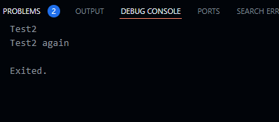

<h1 align="center">

LAPORAN PRAKTIKUM

Pemprograman Mobile


<h2 align="center">

RIZQI REZA DANUARTA

2241720057

TI-3C

## Praktikum 1: Menerapkan Control Flows ("if/else")

### Langkah 1

Ketik atau salin kode program berikut ke dalam fungsi main().

```dart
String test = "test2";
if (test == "test1") {
   print("Test1");
} else If (test == "test2") {
   print("Test2");
} Else {
   print("Something else");
}

if (test == "test2") print("Test2 again");
```

### Langkah 2

Silakan coba eksekusi (Run) kode pada langkah 1 tersebut. Apa yang terjadi? Jelaskan!

jawaban : disaat eksekusi kode program diatas mengalami eror karena terdapat beberapa kode program yang tidak sesuai ketentuan terutama penggunaan huruf besar/kecil yang salah pada if dan else seteleh saya perbaiki kode program yang benar seperti berikut ini

```dart
 String test = "test2";

  if (test == "test1") {
    print("Test1");
  } else if (test == "test2") {
    print("Test2");
  } else {
    print("Something else");
  }

  if (test == "test2") {
    print("Test2 again");
  }
```

dan hasil outputnya seperti berikut ini



penjelasan hasil outpuntya diatas yaitu Karena nilai variable test adalah 'test2' maka output pertama adalah 'Test2', kemudian di kode program paling bawah terdapat kondisi if yang mana jika nilai variable 'test' adalah 'test2' maka outputnya adalah 'Test2 again'.

### Langkah 3

Tambahkan kode program berikut, lalu coba eksekusi (Run) kode Anda.

```dart
String test = "true";
if (test) {
   print("Kebenaran");
}
```

Apa yang terjadi ? Jika terjadi error, silakan perbaiki namun tetap menggunakan if/else.

jawaban : terjadi eror karena pada kode program diatas tipe data String tidak bisa di gunakan pada variabel yang bertipe data boolean. Maka dari itu untuk perbaikan kode program seperti berikut ini

```dart
String test2 = "true";

  // Mengubah String menjadi boolean
  if (test2 == "true") {
    print("Kebenaran");
  } else {
    print("Bukan Kebenaran");
  }
```

dan hasil outpuntya sepeti berikut ini


## Praktikum 2: Menerapkan Perulangan "while" dan "do-while"

### Langkah 1

Ketik atau salin kode program berikut ke dalam fungsi main().

```dart
while (counter < 33) {
  print(counter);
  counter++;
}
```

### Langkah 2

Silakan coba eksekusi (Run) kode pada langkah 1 tersebut. Apa yang terjadi? Jelaskan! Lalu perbaiki jika terjadi error.

jawaban : hasilnya eror dikarenakan pada kode program diatas masih belum lengkap bisa lihat pada variabel counter masih belum diinisialisasi sehingga menyebabkan tidak bisa digunakan pada pengkondisian. Berikut adalah contoh yang benar agar bisa berfungsi

```dart
  //langkah 1
  int counter = 0; // Deklarasi dan inisialisasi variabel counter

  // Loop while untuk mencetak angka dari 0 hingga 32
  while (counter < 33) {
    print(counter);
    counter++;
  }
```

hasil outputnya


penjelasan karena nilai counter adalah 9 maka disaat kode program dieksekusi hasil outputnya akan dimulai dari angka 0 - 32 tergantung berapa inisialisasi dari nilai counter.

### Langkah 3

Tambahkan kode program berikut, lalu coba eksekusi (Run) kode Anda.

```dart
do {
  print(counter);
  counter++;
} while (counter < 77);
```

hasil outputnya


penjelasan karena didalam kode program diatas terdapat pengkondisian nilai counter kurang dari 77 atau counter < 77 maka hasil outputnya hanya sampai angka 76 saja.

## Praktikum 3: Menerapkan Perulangan "for" dan "break-continue"

### Langkah 1

Ketik atau salin kode program berikut ke dalam fungsi main().

```dart
for (Index = 10; index < 27; index) {
  print(Index);
}
```

### Langkah 2

Silakan coba eksekusi (Run) kode pada langkah 1 tersebut. Apa yang terjadi? Jelaskan! Lalu perbaiki jika terjadi error.

jawaban : hasil error karena terdapat salah untuk penulisan variabel dan masih belum ada inisialisasi variabel index solusinya hanya menambahkan int pada perulangan for. Berikut adalah bentuk kode program yang benar

```dart
for (int index = 10; index < 27; index) {
  print(index);
}
```

hasil outputnya


dari kode program diatas variabel index dimulai dari angka 10 dan akan dilanjutkan terus sampai angka 26 saja dikarenakan terdapat pengkondisian index < 27.

### Langkah 3

Tambahkan kode program berikut di dalam for-loop, lalu coba eksekusi (Run) kode Anda.

```dart
If (Index == 21) break;
Else If (index > 1 || index < 7) continue;
print(index);
```


jawaban : Pada kode program tersebut, output tidak muncul seperti yang diharapkan. Ini karena perulangan akan berhenti saat index mencapai nilai 21 karena perintah break. Namun, alasan utama mengapa tidak ada output yang ditampilkan adalah karena perintah print(index) berada setelah kondisi continue, yang akan dilewati pada nilai index antara 2 hingga 6. Dengan demikian, meskipun index mulai dari 10 dan mencetak angka yang tidak memenuhi kondisi continue, perintah print(index) tidak pernah dijalankan karena kondisi continue mengabaikan sisa iterasi jika nilai index di bawah 7 atau di atas 1. Akibatnya, tidak ada nilai yang dicetak sebelum perulangan dihentikan.

berikut adalah bentuk kode program agar mengetahui hasil outputnya

```dart
void main() {
  for (int index = 0; index < 27; index++) {
    if (index == 21) {
      print(index);
      break;
    } else if (index > 1 || index < 7) {
      print(index);
      continue;
    }
    print(index);
  }
}
```

hasil outputnya


jadi saya memodifikasi kode program diatas dengan menambahkan print(index) serta variabel index dimulai dari nilai 0.

### Tugas Praktikum

1. Silakan selesaikan Praktikum 1 sampai 3, lalu dokumentasikan berupa screenshot hasil pekerjaan beserta penjelasannya!

2. Buatlah sebuah program yang dapat menampilkan bilangan prima dari angka 0 sampai 201 menggunakan Dart. Ketika bilangan prima ditemukan, maka tampilkan nama lengkap dan NIM Anda.

jawaban :

```dart
void main() {
  const String namaLengkap = 'Rizqi Reza Danuarta';
  const String nim = '2241720057';

  for (int num = 0; num <= 201; num++) {
    if (isPrime(num)) {
      print('Bilangan prima: $num\nNama: $namaLengkap\nNIM: $nim\n---');
    }
  }
}

bool isPrime(int number) {
  if (number <= 1) return false;
  if (number == 2) return true;
  if (number % 2 == 0) return false;

  for (int i = 3; i * i <= number; i += 2) {
    if (number % i == 0) return false;
  }
  return true;
}
```

hasil output


3. Kumpulkan berupa link commit repo GitHub pada tautan yang telah disediakan di grup Telegram!
