<h1 align="center">

LAPORAN PRAKTIKUM

Pemprograman Mobile


<h2 align="center">

RIZQI REZA DANUARTA

2241720057

TI-3C

## Praktikum 1: Eksperimen Tipe Data List

Selesaikan langkah-langkah praktikum berikut ini menggunakan VS Code atau Code Editor favorit Anda.

### Langkah 1

Ketik atau salin kode program berikut ke dalam fungsi main().

```dart
var list = [1, 2, 3];
assert(list.length == 3);
assert(list[1] == 2);
print(list.length);
print(list[1]);

list[1] = 1;
assert(list[1] == 1);
print(list[1]);
```

hasil output :

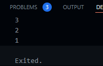

### Langkah 2

Silakan coba eksekusi (Run) kode pada langkah 1 tersebut. Apa yang terjadi? Jelaskan!

jawaban : hasilnya tidak ada error dimana dalam kode diatas menggunakan Fungsi assert digunakan untuk melakukan pengecekan atau validasi. Dalam hal ini, assert memastikan bahwa panjang daftar (list.length) adalah 3. Jika kondisi ini tidak terpenuhi (misalnya, jika panjang daftar bukan 3), program akan menghasilkan kesalahan dan berhenti.

### Langkah 3

Ubah kode pada langkah 1 menjadi variabel final yang mempunyai index = 5 dengan default value = null. Isilah nama dan NIM Anda pada elemen index ke-1 dan ke-2. Lalu print dan capture hasilnya.

Apa yang terjadi ? Jika terjadi error, silakan perbaiki.

```dart
final List<String?> listNim =
      List.filled(6, null); // List dengan 6 elemen null
  listNim[1] = 'Nama: Rizqi Reza Danuarta, NIM: 2241720057';
  listNim[2] = 'Nama: Rizqi Reza Danuarta, NIM: 2241720057';

  print(listNim[1]);
  print(listNim[2]);
```

Hasil Output :

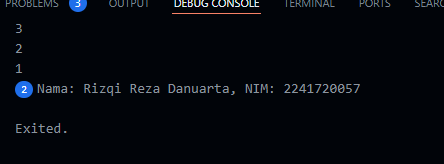

## Praktikum 2: Eksperimen Tipe Data Set

### Langkah 1

Ketik atau salin kode program berikut ke dalam fungsi main().

```dart
var halogens = {'fluorine', 'chlorine', 'bromine', 'iodine', 'astatine'};
  print(halogens);
```

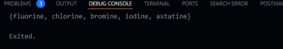

### Langkah 2

Silakan coba eksekusi (Run) kode pada langkah 1 tersebut. Apa yang terjadi? Jelaskan! Lalu perbaiki jika terjadi error.

jawaban : tidak ada eror, pada kode program diatas mendefinisikan variabel halogens yang merupakan sebuah tipe data set berisi 'fluorine', 'chlorine', 'bromine', 'iodine', 'astatine'. Set dalam dart adalah sebuah koleksi yang tidak mengizinkanduplikasi elemen dan elemen-elemen tidak terstruktur.

### Langkah 3

Tambahkan kode program berikut, lalu coba eksekusi (Run) kode Anda.

```dart
 var names1 = <String>{};
  Set<String> names2 = {};
  var names3 = {};

  print(names1);
  print(names2);
  print(names3);
```

hasil outputnya :

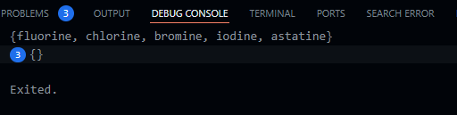

Apa yang terjadi ? Jika terjadi error, silakan perbaiki namun tetap menggunakan ketiga variabel tersebut. Tambahkan elemen nama dan NIM Anda pada kedua variabel Set tersebut dengan dua fungsi berbeda yaitu .add() dan .addAll(). Untuk variabel Map dihapus, nanti kita coba di praktikum selanjutnya.

jawaban : Kode di atas menunjukkan bahwa names1 dan names2 dideklarasikan sebagai set kosong bertipe String, sementara names3 secara default dianggap sebagai map kosong karena tidak ada tipe data eksplisit. Meskipun ketiganya dicetak sebagai {}, mereka merepresentasikan tipe data yang berbeda.

berikut adalah bentuk penambahan fungsi add. dan addAll

```dart
var names1 = <String>{};
  Set<String> names2 = {};
  names1.add('Nama : Rizqi Reza Danuarta, NIM : 2241720057');
  names2.addAll(['Nama : Rizqi Reza Danuarta, NIM : 2241720057']);

  print(names1);
  print(names2);
```

hasil output :

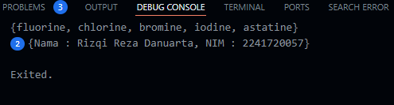

## Praktikum 3: Eksperimen Tipe Data Maps

### Langkah 1

Ketik atau salin kode program berikut ke dalam fungsi main().

```dart
var gifts = {
    // Key:   Value
    'first': 'partridge',
    'second': 'turtledove',
    'third': 1
  };

  var nobleGases = {
    2: 'helium',
    10: 'neon',
    18: 2,
  };

  print(gifts);
  print(nobleGases);
```

hasil output :

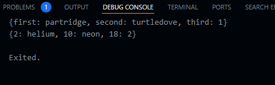

### Langkah 2

Silakan coba eksekusi (Run) kode pada langkah 1 tersebut. Apa yang terjadi? Jelaskan! Lalu perbaiki jika terjadi error.

jawaban : Kode tersebut mendefinisikan dua map: gifts dengan string sebagai kunci dan nilai berupa string atau integer, serta nobleGases dengan integer sebagai kunci dan nilai berupa string atau integer. Kedua map menunjukkan bahwa Dart memungkinkan penyimpanan berbagai tipe data sebagai nilai, dan hasilnya akan dicetak sebagai pasangan kunci-nilai.

### Langkah 3

Tambahkan kode program berikut, lalu coba eksekusi (Run) kode Anda.

```dart
var mhs1 = Map<String, String>();
  gifts['first'] = 'partridge';
  gifts['second'] = 'turtledoves';
  gifts['fifth'] = 'golden rings';

  var mhs2 = Map<int, String>();
  nobleGases[2] = 'helium';
  nobleGases[10] = 'neon';
  nobleGases[18] = 'argon';
```


jawaban : masih terdapat beberapa hal yang perlu ditambahkan agar kode program berjalan dengan lancar

berikut adalah bentuk kode program agar mengetahui hasil outputnya

```dart
var mhs1 = <String, String>{};
  mhs1['nama'] = 'Rizqi Reza Danuarta';
  mhs1['nim'] = '2241720057';
  var mhs2 = <String, String>{};
  mhs2['nama'] = 'Rizqi Reza Danuarta';
  mhs2['nim'] = '2241720057';

  // Menambahkan data dengan tipe kunci dan nilai yang konsisten
  mhs1.addAll({'first': 'golden rings'});
  mhs2.addAll({'18': 'argon'}); // Kunci harus bertipe String, jadi '18' sebagai string

  print(mhs1);
  print(mhs2);
```

hasil output :

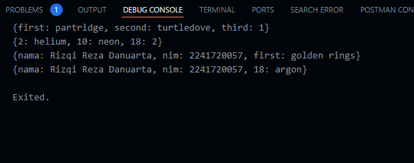

## Praktikum 4: Eksperimen Tipe Data List: Spread dan Control-flow Operators

### Langkah 1

Ketik atau salin kode program berikut ke dalam fungsi main().

```dart
var list1 = [1, 2, 3];
  var list2 = [0, ...list1];
  print(list1);
  print(list2);
  print(list2.length);
```

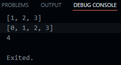

### Langkah 2

Silakan coba eksekusi (Run) kode pada langkah 1 tersebut. Apa yang terjadi? Jelaskan! Lalu perbaiki jika terjadi error.

jawaban : kode program diatas terdapat penggunaan spread operator(...)dimana didar iniberfungsi untuk menggabungkan list dimana List pertama, list1, berisi elemen [1, 2, 3]. List kedua, list2, dibentuk dengan menyertakan elemen 0 di depan elemen-elemen dari list1 menggunakan spread operator. Akibatnya, list2 menjadi [0, 1, 2, 3]. Kode ini kemudian mencetak list1 yang tetap sebagai [1, 2, 3], list2 yang sekarang berisi [0, 1, 2, 3], dan panjang list2 yang adalah 4.

### Langkah 3

Tambahkan kode program berikut, lalu coba eksekusi (Run) kode Anda.

```dart
list1 = [1, 2, null];
print(list1);
var list3 = [0, ...?list1];
print(list3.length);
```

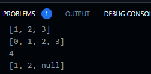

Apa yang terjadi ? Jika terjadi error, silakan perbaiki.

jawaban : kode program diatas berjalan dengan baik tidak ada eror

Tambahkan variabel list berisi NIM Anda menggunakan Spread Operators. Dokumentasikan hasilnya dan buat laporannya!

berikut adalah bentuk kode program yang terdapat variabel list berisi nim

```dart
var list3 = [1, 2, null];
  print(list3); // Output: [1, 2, null]

  var list4 = [2241720057, ...?list3];
  print(list4);
  print(list3.length);
```

### Langkah 4

Tambahkan kode program berikut, lalu coba eksekusi (Run) kode Anda

```dart
var nav = ['Home', 'Furniture', 'Plants', if (promoActive) 'Outlet'];
print(nav);
```

Apa yang terjadi ? Jika terjadi error, silakan perbaiki. Tunjukkan hasilnya jika variabel promoActive ketika true dan false.

jawaban : Hasilnya eror dikarenakan variabel promoActive tidak terdefinisi dengan benar

```dart
bool promoActive = true;
  var nav = ['Home', 'Furniture', 'Plants', if (promoActive) 'Outlet'];
  print(nav);
```

hasil output jika true :

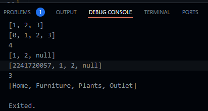

hasil output jika false :

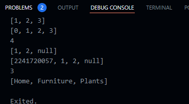

### Langkah 5

Tambahkan kode program berikut, lalu coba eksekusi (Run) kode Anda.

```dart
var nav2 = ['Home', 'Furniture', 'Plants', if (login case 'Manager') 'Inventory'];
print(nav2);
```

Apa yang terjadi ? Jika terjadi error, silakan perbaiki. Tunjukkan hasilnya jika variabel login mempunyai kondisi lain.

jawaban : hasilnya eror terdapat pada case manager dikarenakan belum terdapat inisialisasi berikut adalah bentuk kode program yang benar

```dart
  var login = 'Manager';
  var nav2 = [
    'Home',
    'Furniture',
    'Plants',
    if (login case 'Manager') 'Inventory'
  ];
```

hasil output jika kondisi login case sebagai manager

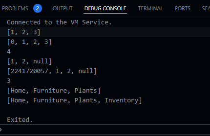

hasil output jika kondisi login case bukan sebagai manager

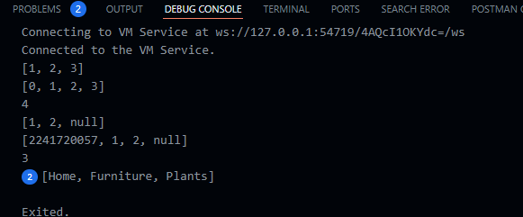

### Langkah 6

Tambahkan kode program berikut, lalu coba eksekusi (Run) kode Anda.

```dart
var listOfInts = [1, 2, 3];
var listOfStrings = ['#0', for (var i in listOfInts) '#$i'];
assert(listOfStrings[1] == '#1');
print(listOfStrings);
```

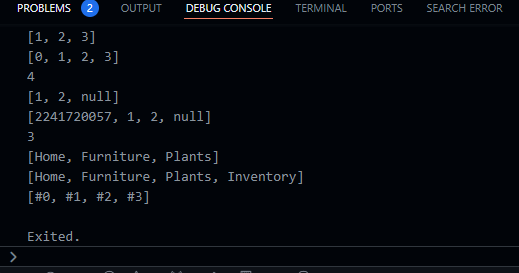

Apa yang terjadi ? Jika terjadi error, silakan perbaiki. Jelaskan manfaat Collection For dan dokumentasikan hasilnya.

jawaban : manfaat dari collection for yaitu digunakan untuk mengisi list atau set secara dinamis menggunakan loop

## Praktikum 5: Eksperimen Tipe Data Records

### Langkah 1

Ketik atau salin kode program berikut ke dalam fungsi main().

```dart
var record = ('first', a: 2, b: true, 'last');
print(record)
```

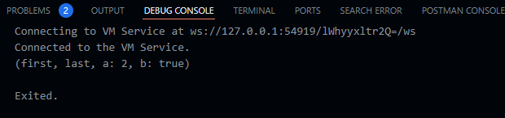

### Langkah 2

Silakan coba eksekusi (Run) kode pada langkah 1 tersebut. Apa yang terjadi? Jelaskan! Lalu perbaiki jika terjadi error.

jawaban : kode diatas mencoba membuat dan mencetak sebuah record atau tuple dengan mendeklarasikan dan menggunakan records

### Langkah 3

Tambahkan kode program berikut di luar scope void main(), lalu coba eksekusi (Run) kode Anda.

```dart
(int, int) tukar((int, int) record) {
  var (a, b) = record;
  return (b, a);
}
```

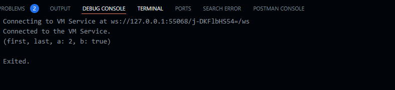

Apa yang terjadi ? Jika terjadi error, silakan perbaiki. Gunakan fungsi tukar() di dalam main() sehingga tampak jelas proses pertukaran value field di dalam Records.

berikut jika fungsi tukar berada didalam main

```dart
ar originalRecord = (1, 2);
  print('Original record: $originalRecord');
  var swappedRecord = tukar(originalRecord);
  print('Swapped record: $swappedRecord');
```

hasil output :

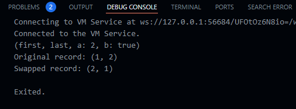

### Langkah 4

Tambahkan kode program berikut di dalam scope void main(), lalu coba eksekusi (Run) kode Anda.

```dart
(String, int) mahasiswa;
print(mahasiswa);
```

Apa yang terjadi ? Jika terjadi error, silakan perbaiki. Inisialisasi field nama dan NIM Anda pada variabel record mahasiswa di atas. Dokumentasikan hasilnya dan buat laporannya!

jawaban : hasil kodenya eror dikarenakan pada variabel mahasiswa tidak terdapat value jadi harus diisikan value berikut adalah bentuk kode yang benar

```dart
(String, int) mahasiswa = ('Tenza', 24);
  print(mahasiswa);
```

### Langkah 5

Tambahkan kode program berikut di dalam scope void main(), lalu coba eksekusi (Run) kode Anda.

```dart
var mahasiswa2 = ('first', a: 2, b: true, 'last');

print(mahasiswa2.$1); // Prints 'first'
print(mahasiswa2.a); // Prints 2
print(mahasiswa2.b); // Prints true
print(mahasiswa2.$2); // Prints 'last'
```

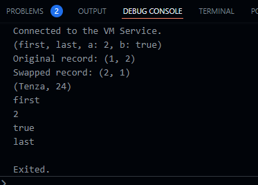

Apa yang terjadi ? Jika terjadi error, silakan perbaiki. Gantilah salah satu isi record dengan nama dan NIM Anda, lalu dokumentasikan hasilnya dan buat laporannya!

jawaban : kode berjalan dengan baik tidak ada eror dan hasil outputnya sesuai dengan kode yang diketikkan

berikut adalah bentuk kode jika salah satu isi recordnua berisi nama dan nim

```dart
var mahasiswa2 = ('Rizqi Reza Danuarta', a: '2241720057', b: true, 'last');
  print(mahasiswa2.$1); // prints 'first'
  print(mahasiswa2.a); // prints 2
  print(mahasiswa2.b); // prints true
  print(mahasiswa2.$2); // prints 'last'
```

hasil output :

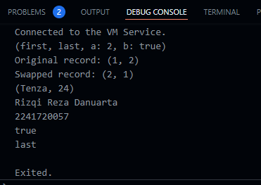

## Tugas Praktikum

1. Silakan selesaikan Praktikum 1 sampai 5, lalu dokumentasikan berupa screenshot hasil pekerjaan Anda beserta penjelasannya!

2. Jelaskan yang dimaksud Functions dalam bahasa Dart!

jawaban : Functions dalam dart adalah sebuah blok kode yang akan dijalankan ketika dipanggil. Function dapat digunakan untuk mengelompokkan kode sehingga lebih mudah dibaca dan digunakan kembali.

3. Jelaskan jenis-jenis parameter di Functions beserta contoh sintaksnya!

   jawaban :

- Named Parameter

  Dapat menjadi required atau opsional

  ```dart
  void enableFlags({bool? bold, bool? hidden}) {
    print('Bold: $bold');
    print('Hidden: $hidden');
  }

  void main() {
    // Memanggil fungsi dengan menggunakan named parameters
    enableFlags(bold: true, hidden: false);
  }
  ```

* Optional Positional Parameter

parameter fungsi yang dapat diabaikan saat pemanggilan fungsi dan diidentifikasi berdasarkan posisi argument yang diberikan, memungkinkan fleksibilitas dalam memberikan argumen sesuai kebutuhan.

```dart
void printDetails(String name, [int age, String country]) {
  print('Name: $name');
  if (age != null) {
    print('Age: $age');
  }
  if (country != null) {
    print('Country: $country');
  }
}

void main() {
  // Memanggil fungsi dengan argument sesuai posisi
  printDetails('John');
  printDetails('Jane', 30);
  printDetails('Doe', 25, 'USA');
}
```

4. Jelaskan maksud Functions sebagai first-class objects beserta contoh sintaknya!

jawaban : First-class dianggap sebagai entitas yang dapat diperlakukan dengan cara yang sama seperti entitas lain dalam bahasa pemrograman, sehingga memungkinkan kita untuk memperlakukan fungsi seperti variabel, seperti menggunakan fungsi sebagai argumen untuk parameter ketika memanggil fungsi.

contoh :

```dart

int add(int x, int y) {
  return x + y;
}

int launchOperation(Function operation, int x, int y) {
  return operation(x, y);
}

void main(){
int hasil = launchOperation(tambah, 5, 3);

print(hasil);  // Output: 8
}
```

5. Apa itu Anonymous Functions? Jelaskan dan berikan contohnya!

jawaban : fungsi anonim dalam Dart adalah fungsi yang tidak memiliki nama dan dapat didefinisikan dan digunakan tanpa perlu mendeklarasikan namanya.

```dart
void launchOperation(int x, int y, Function operate) {
 int result = operate(x, y);
 print("Result: $result");
}

void main() {

 launchOperation(5, 3, (a, b) {
   return a + b;
 });
}
```

6. Jelaskan perbedaan Lexical scope dan Lexical closures! Berikan contohnya!

jawaban : Lexical scope adalah konsep di mana akses ke variabel dalam suatu fungsi ditentukan oleh struktur penulisan kode pada waktu kompilasi, sementara lexical closures adalah kemampuan sebuah fungsi untuk "mengingat" lingkungan (variabel lokal, parameter, dan fungsi lain) di sekitarnya bahkan setelah fungsi tersebut selesai dieksekusi.

```dart
// Contoh Lexical Scope

void main() {
  int x = 10;

  void printValue() {
    print(x); // Memiliki akses ke variabel x karena berada dalam lexical scope
  }

  printValue(); // Memanggil fungsi printValue
}
// Contoh Lexical Closure

Function createAdder(int x) {
  return (int y) => x + y; // Menciptakan closure yang mengingat nilai x
}

void main() {
  int base = 5;
  var adder = createAdder(base);

  print(adder(10)); // Output: 15 (base + 10)
}
```

7. Jelaskan dengan contoh cara membuat return multiple value di Functions!

jawaban : mengembalikan multiple values menggunakan tipe data seperti List, Map, atau custom class.

```dart
// Menggunakan List

List<int> calculate(int a, int b) {
  int sum = a + b;
  int difference = a - b;
  return [sum, difference];
}

void main() {
  List<int> result = calculate(10, 5);
  print('Sum: ${result[0]}, Difference: ${result[1]}');
}
// Menggunakan Map

Map<String, int> calculate(int a, int b) {
  int sum = a + b;
  int difference = a - b;
  return {'sum': sum, 'difference': difference};
}

void main() {
  Map<String, int> result = calculate(10, 5);
  print('Sum: ${result['sum']}, Difference: ${result['difference']}');
}
// Menggunakan Custom Classs

class CalculationResult {
  int sum;
  int difference;

  CalculationResult(this.sum, this.difference);
}

CalculationResult calculate(int a, int b) {
  int sum = a + b;
  int difference = a - b;
  return CalculationResult(sum, difference);
}

void main() {
  CalculationResult result = calculate(10, 5);
  print('Sum: ${result.sum}, Difference: ${result.difference}');
}
```
